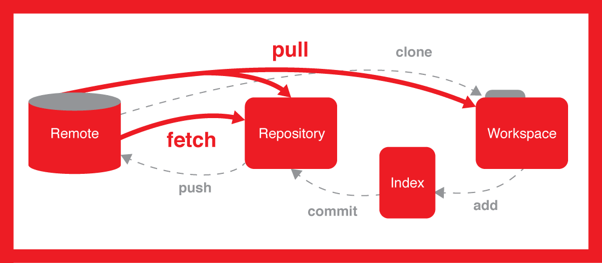

# Git cơ bản và nâng cao

- Phần I: Bắt đầu với Git
- Phần II: Làm việc nhóm với Git

---

## Git dành cho người mới bắt đầu

- Giới thiệu về Git
- GUI vs CLI
- Linux/Unix Command Line
- Cách khởi tạo một Git repository
- Cách tạo commit
- Cách xem nội dung một commit
- Cách tạo một remote repository với GitHub, GitLab, Bitbucket
- Cách đồng bộ giữa local và remote repository
- Cách chia sẽ repository của mình với người khác
- Cách clone một repository được chia sẽ từ người khác
- Git GUI
- Thực hành tạo trang GitHub profile cá nhân

---

### Giới thiệu về Git

- Quản lý version cho tài liệu (Plain Text)
- Mã nguồn Linux kernel
- Hệ thống phân tán
- Git vs (GitHub, GitLab, Bitbucket)
- Nhà cung cấp dịch vụ Git

---

### GUI vs CLI

Lý do nên học Git CLI trước:

- Giống nhau ở mọi nơi
- Đầy đủ tính năng
- Dễ dàng tìm kiếm sự trợ giúp

Lý do dùng Git GUI:

- Xem lịch sử dễ dàng hơn
- Xem nội dung thay đổi (side-by-side)

---

### Cài đặt Git

#### macOS

```bash
brew install git
```

#### Ubuntu

```bash
sudo apt-get install git
```

#### Windows

https://git-scm.com/download/win

#### Kiểm tra cài đặt

```bash
git --version
```

---

### Linux Command Line căn bản

- Command Line Interface (CLI)
- Cách mở Terminal
- Xem thư mục hiện tại `pwd`
- Liệt kê nội dung thư mục `ls -l <dir_path>`
- Hiện nội dung ẩn `ls -la <dir_path>`
- Một số thư mục đặc biệt `/`, `~`, `.`, `..`
- Chuyển thư mục `cd <dir_path>`
- Tạo thư mục `mkdir <dir_path>`
- Xoá thư mục `rmdir <dir_path>` (`rm -r <dir_path>`)
- Tạo file `touch <file_path>`
- Xoá file `rm <file_path>`
- Sửa file `nano <file_path>`, `vi <file_path>`
- Xem nội dung file `cat <file_path>`
- Chạy lệnh dưới quyền super user `sudo <cmd>`
- Trợ giúp `<cmd> -h`, `man <cmd>`

#### Mẹo

- Dùng TAB để được nhắc code (autocomplete)
- Dùng phím mũi tên lên/xuống để xem lại các lệnh gần đây
- Ctrl+R để tìm kiếm một lệnh đã chạy trong quá khứ
- Ctrl+C để dừng lệnh đang chạy

---

### Khởi tạo Git repository

- Là một thư mục bất kỳ
- Chứa thư mục ẩn `.git`
- Chạy lệnh `git init`

---

### Cấu hình Git

- User name `git config user.name "Nha Hoang"`
- User email `git config user.email "hdnha11@gmail.com"`
- `cat ./.git/config`

> Global config `git config --global user.email "hdnha11@gmail.com"`
> `cat ~/.gitconfig`

---

### Thêm file vào Git

- Xem trạng thái của repository `git status`
- Xem nội dung thay đổi `git diff`
- File mới thêm sẽ có trạng thái _Untracked_
- Working tree
- Staging area (Index)
- Thêm file vào index với `git add`

#### Vòng đời của trạng thái file


#### Khái quát Git



Nguồn ảnh:

- https://git-scm.com/book/en/v2/Git-Basics-Recording-Changes-to-the-Repository
- https://medium.com/happyfresh-fleet-tracker/git-101-pushing-pulling-etc-67ea989f74e0

---

### Tạo commit

- Hoàn thành một việc
- Ghi mô tả để có thể xem lại sau
- Bao gồm các file trong index
- Chạy lệnh `git commit -m "<message>"`

---

### .gitignore

- Loại trừ một số file khỏi Git
- _.DS_Store_, log file...
- Git sẽ bỏ qua danh sách file trong file ẩn `.gitignore`
- Có thể dùng ký tự wildcard (`*`) với tên file (`*.log`...)

---

### Huỷ bỏ thay đổi

- `git reset`
- `git checkout <path>`
- `git clean -df`

---

### Xem nội dung một commit

- Những thay đổi trong một commit
- `git show <commit_hash>`

---

### Git lưu trữ thông tin như thế nào?

- **CHÚ Ý**: Kiến thức nâng cao
- Object database
- Object hash
- Commit, tree, blob

Ví dụ một snapshot của file `README.md` bên trong repo `git-intro`:

```bash
git show c04b8a8
git cat-file -p c04b8a8
git cat-file -p af332c6
git cat-file -p 6788a85
deflate -f .git/objects/67/88a8515d175478a1ddd01694209ab09a9da19f
deflate -f .git/objects/67/88a8515d175478a1ddd01694209ab09a9da19f | shasum
```

> Tool deflate nằm bên trong thư mục git-intro/deflate.


Nguồn:

- https://courses.csail.mit.edu/6.S194/13/lessons/03-git/git-internally.html
- https://craigtaub.dev/under-the-hood-of-git

---

### Tạo remote repository

- [GitHub](https://github.com)
- [GitLab](https://gitlab.com)
- [Bitbucket](https://bitbucket.org)

http://git-scm.com/book/en/v2/GitHub-Account-Setup-and-Configuration

---

### Cấu hình SSH

- Secure Shell
- Thông tin được mã hoá
- Không cần dùng username/password
- Tạo một cặp key public-private
- Thêm public key vào https://github.com/settings/keys
- Giữ cho private key được an toàn

#### Cách tạo cặp key

```bash
ssh-keygen -t ed25519 -C "your_email@example.com"
cat ~/.ssh/id_ed25519.pub
```

> https://docs.github.com/en/authentication/connecting-to-github-with-ssh/generating-a-new-ssh-key-and-adding-it-to-the-ssh-agent

#### Kiểm tra cấu hình SSH

```bash
ssh -T git@github.com
# Hi <your_github_account>! You've successfully authenticated, but GitHub does not provide shell access.
```

---

### Đẩy nội dung local lên remote repository

```bash
git push
```

> https://onlywei.github.io/explain-git-with-d3/#push

---

### Thêm thành viên vào GitHub repository

- Public vs Private repositories
- Quản lý thành viên

---

### Kéo nội dung mới từ remote repository

- `git fetch`
- `git pull`

> https://onlywei.github.io/explain-git-with-d3/#fetch
> https://onlywei.github.io/explain-git-with-d3/#pull

---

### Cách clone một repository

- Repository được chia sẽ
- `git clone git@github.com:hdnha11/git-intro.git`

---

### Quy trình làm việc điển hình

1. Khởi tạo hoặc clone repository (`git init` or `git clone <url>`)
2. Thêm file mới hoặc chỉnh sửa file cũ (Text Editor)
3. Thêm file vào index (`git add <file list>`)
4. Tạo commit (`git commit -m "message"`)
5. Push (`git push`)
6. Lặp lại bước 2

---

### Một số công cụ GUI cho Git

- [Sourcetree](https://www.sourcetreeapp.com)
- Visual Studio Code (integrated SCM)

> SCM: Source Control Management

---

### Tạo GitHub Profile Repository

- Repository đặc biệt (trùng tên với username)
- Markdown
- Cách căn chỉnh hình ảnh với GitHub markdown
- Tự động sinh thông tin stats

> https://github.com/anuraghazra/github-readme-stats

---

## Làm việc nhóm với Git

- Giới thiệu về mô hình làm việc nhóm với Git
- Cách tạo và quản lý nhánh
- Merge và rebase nhánh
- Cách thay đổi lịch sử của nhánh
- Đụng độ là gì
- Cách xử lý khi xảy ra đụng độ
- Giới thiệu về GitHub Flow
- Pull Request là gì
- Review và merge Pull Request
- CI/CD với GitHub Actions
- Thực hành làm việc nhóm với Git

---

### Mô hình làm việc nhóm phân tán

- Các thành viên làm việc độc lập
- Không cần kết nối tới server để có thể xem lịch sử hoặc tạo commit
- Có thể chia nhiều nhánh để phát triển nhiều tính năng cùng lúc
- Có thể merge nhiều nhánh lại với nhau sau khi hoàn thành
- Có thể khôi phục remote server từ local repository

---

### Nhánh

- Con trỏ tới một snapshot của repository (hiểu đơn giản là commit)
- Có thể checkout tới một nhánh hoặc một commit
- `HEAD` luôn chỉ đến snapshot hiện tại
  - Có thể là nhánh
  - Hoặc là một commit (trạng thái `detached HEAD`)
- Checkout đơn giản là cập nhật giá trị `HEAD`

> Luôn sử dụng nhánh khi làm việc (không dùng detached HEAD trừ khi chỉ dùng để xem một commit cũ).
> Việc này đảm bảo chúng ta luôn có một tham chiếu tới những commit mới.

---

### Tạo nhánh và quản lý nhánh

- Tạo nhánh `git branch <branch_name>`
- Tạo nhánh và checkout `git checkout -b <branch_name>`
- Liệt kê nhánh `git branch -a`
- Chuyển nhánh `git switch <branch_name>`, `git checkout <branch_name>`
- Xoá nhánh `git branch -d <branch_name>`
- Xoá nhánh force `git branch -D <branch_name>`
- Commit vào nhánh
- Push/Pull nhánh

> https://onlywei.github.io/explain-git-with-d3/#branch

---

### `git checkout` vs `git switch/restore`

| git checkout                         | Trỏ HEAD đến   | Tác động đến file   | git switch/restore                        |
| ------------------------------------ | -------------- | ------------------- | ----------------------------------------- |
| `git checkout <file_path>`           | Không đổi      | Trong `<file_path>` | `git restore <file_path>`                 |
| `git checkout -- <file_path>`        | Không đổi      | Trong `<file_path>` | `git restore <file_path>`                 |
| `git checkout <tree> <file_path>`    | Không đổi      | Trong `<file_path>` | `git restore --source <tree> <file_path>` |
| `git checkout <tree> -- <file_path>` | Không đổi      | Trong `<file_path>` | `git restore --source <tree> <file_path>` |
| `git checkout <branch>`              | `<branch>`     | Tất cả              | `git switch <branch>`                     |
| `git checkout <commit>`              | `<commit>`     | Tất cả              | `git switch --detach <commit>`            |
| `git checkout --detach <commit>`     | `<commit>`     | Tất cả              | `git switch --detach <commit>`            |

> [Dùng lệnh switch/restore thay cho checkout](https://github.blog/2019-08-16-highlights-from-git-2-23)

---

### Merge nhánh

- Merge `<branch>` vào nhánh hiện tại `git merge <branch>`
- Tạo một *merge commit* trên nhánh hiện tại
- Có thể merge cùng lúc nhiều nhánh
- Có khả năng xảy ra đụng độ (conflict)
- `git merge (--continue | --abort)`

> https://onlywei.github.io/explain-git-with-d3/#merge

---

### Rebase nhánh

- Dùng `<branch>` làm **new base** cho nhánh hiện tại `git rebase <branch>`
- Tạo ra commit mới cho những commit phía sau commit cuối cùng của nhánh base
- Có khả năng xảy ra đụng độ
- `git rebase (--continue | --abort)`

> https://onlywei.github.io/explain-git-with-d3/#rebase

---

### Thay đổi lịch sử

- Xoá commit
- Thay đổi commit message
- Thay đổi tác giả commit
- Gộp nhiều commit thành một

> https://onlywei.github.io/explain-git-with-d3/#reset

---

### Revert commit

- Revert commit thường
- Revert merge commit (có nhiều hơn 1 cha)
- Tạo ra một commit mới có nội dung ngược lại với commit cần revert
- Cách làm này của Git rất an toàn

> https://onlywei.github.io/explain-git-with-d3/#revert

---

### Đụng độ

- Merge/Rebase nhánh
- Cùng sửa trên cùng dòng của cùng file
- Sửa trên file đã bị xoá

```bash
# Init
mkdir git-merge-test
cd git-merge-test
git init .
echo "this is some content to mess with" > merge.txt
git add merge.txt
git commit -m "we are commiting the inital content"
# Create new branch and add a new commit
git checkout -b new_branch_to_merge_later
echo "totally different content to merge later" > merge.txt
git commit -am "edited the content of merge.txt to cause a conflict"
# Back to master and add one more commit
git checkout master
echo "content to append" >> merge.txt # append to file
git commit -am "appended content to merge.txt"
# Merge new_branch_to_merge_later to master
git merge new_branch_to_merge_later
# BOOM 💥. A conflict appears
```

> https://www.atlassian.com/git/tutorials/using-branches/merge-conflicts

---

### Giải quyết đụng độ

- Xem thay đổi
- Merge code
- Đánh dấu đã giải quyết xong với `git add`
- Tiếp tục quá trình merge/rebase (`--continue`)

#### Text Editor mặc định của Git

- Mặc định là Vim
- Có thể chuyển sang editor quen thuộc

```bash
git config --global core.editor "nano"
```

> https://stackoverflow.com/a/2596835

---

### Giới thiệu về GitHub Flow

- Lightweight
- Dựa trên nhánh

Tóm tắt flow:

1. Tạo nhánh (feature, bugfix...)
2. Tạo thay đổi trên nhánh (1 hoặc nhiều commit)
3. Tạo pull request
4. Xử lý bình luận từ những thành viên khác
5. Merge pull request
6. Xoá nhánh

> https://docs.github.com/en/get-started/quickstart/github-flow

---

### Stash

- Lưu tạm việc đang làm dở
- Chưa sẵn sàng để commit
- Lưu tạm với `git stash`
- Lấy từ stash ra và làm tiếp (xoá khỏi stash) `git stash pop`
- Lấy từ stash ra và làm tiếp (không xoá) `git stash apply`
- Xem danh sách stash `git stash list`

> Mặc định Git sẽ không stash untracked và ignored file. Có thể dùng [tuỳ chọn](https://www.atlassian.com/git/tutorials/saving-changes/git-stash#stashing-untracked-or-ignored) nếu cần.

> Cách khác là cứ commit lại trước (WIP), sau đó quay lại làm tiếp và commit nối vào với `git commit --amend`.

---

### Pull Request là gì

- Là khái niệm của Git provider (không phải của Git)
- Dùng để thông báo với thành viên khác những thay đổi mà bạn tạo ra
- Sau khi PR được mở, các thành viên có thể review và thảo luận ngay trên PR
- Tác giả có thể có những follow-up commit
- Sau khi được chấp thuận bởi các thành viên thì PR có thể được merge vào nhánh chính

---

### Review và Merge Pull Request

- Demo time

---

### CI/CD với GitHub Actions

- Giúp tự động hoá quy trình làm việc
- Build, test và deloy
- Thực hành tạo một workflow đơn giản

> https://docs.github.com/en/actions

---

### Thực hành làm việc nhóm với Git

- Một nhóm 2 thành viên
- Mô tả chi tiết [tại đây](#)

## Tài liệu tham khảo

- http://git-scm.com/book/en/v2
- https://www.atlassian.com/git/tutorials
- https://shop.jcoglan.com/building-git/
